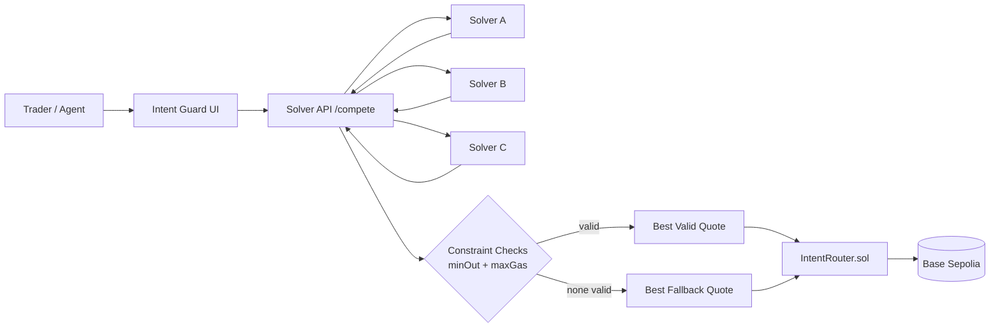

# Intent Guard Architecture

## Design goals
- User specifies **outcome + constraints**.
- Solvers compete on route quality.
- Selection prioritizes **valid** quotes.
- Execution proof anchored onchain.

## Safety controls
- Min output enforcement
- Max gas guard
- Solver allowlist (current MVP)
- Fee recipient + ownership mutability for operability
