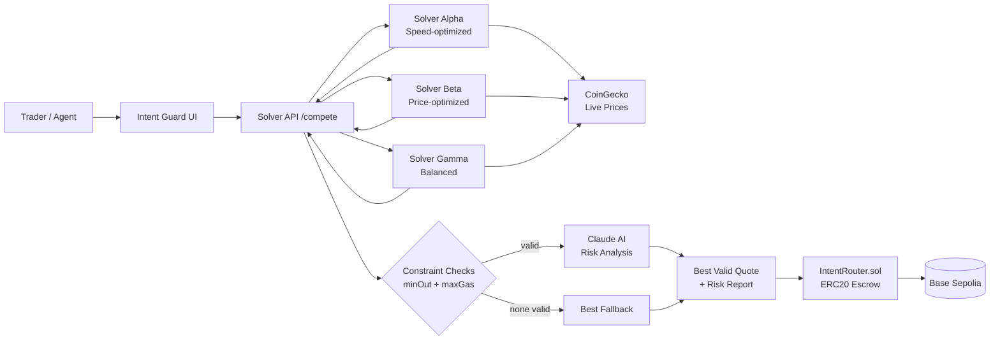

# Intent Guard Architecture

## Flow

1. **Intent submission** — User specifies token pair, amount, constraints
2. **Solver competition** — Three solver profiles fetch live CoinGecko prices, generate quotes with per-solver variance
3. **Constraint validation** — Each quote checked against minAmountOut and maxGasWei
4. **AI risk analysis** — Claude Haiku analyzes all quotes for MEV risk, price anomalies, slippage danger
5. **Selection** — Best valid quote selected (fallback if none valid)
6. **Onchain creation** — `createIntent()` escrows tokenIn via ERC20 transferFrom
7. **Onchain fill** — `fillIntent()` atomically: pulls tokenOut from solver, sends to user (minus fee), sends fee to recipient, releases tokenIn to solver
8. **Cancel/expire** — User can cancel anytime; anyone can mark expired after deadline; escrowed tokens always returned

## Safety controls

- ERC20 escrow (tokens locked, not just bookkeeping)
- Reentrancy guard on all state-changing functions
- Checks-effects-interactions pattern
- Min output enforcement
- Max gas guard
- Solver allowlist
- AI risk analysis (MEV, price, slippage)
- Protocol fee capped at 1% (100 bps max)
- Graceful fallbacks (CoinGecko down → fallback prices, Claude down → unanalyzed)

## Solver profiles

| Solver | Strategy | Price Edge | Gas | Confidence | Route |
|---|---|---|---|---|---|
| solver-alpha | Speed | -0.2% | Low (21T) | 88% | UniV3-Direct |
| solver-beta | Price | +0.3% | High (38T) | 82% | UniV3 + Curve + Balancer |
| solver-gamma | Balanced | +0.1% | Medium (28T) | 85% | UniV3 + SushiV2 |
